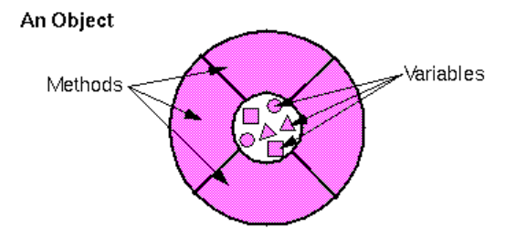

# 객체란?

이전에 만든 프로그램에서 Animal 이라는 구조체를 가져와서 살펴봅시다.

``` c++
typedef struct Animal {
	char name[30];
	int age;

	int health;
	int food;
	int clean;
}				Animal;
```

위와 같이 Animal 구조체를 정의한 후 animal 변수를 만들어서 이를 필요로 하는 함수들에게

``` c++
play(list[play_with]);
```

이와 같이 전달해 주었습니다.

그런데 곰곰히 생각해보면 play 함수에 인자로 전달하는 것이 이상합니다.

이 상황을 생각해보면 play가 animal을 하는 것처럼 느껴집니다.

다시 생각해보면 animal이 play를 하는 것이 더 맞는 표현이라고 생각이 듭니다.

만약 다음과 같이 작성할 수 있다면 play 함수에 animal을 인자로 주지 않아도 됩니다.

``` cpp
Animal animal;

animal.play();
animal.sleep();
```

이렇게 작성하면 animal이 play하는 것이기 때문에 이미 play 함수가 알고 있기 때문입니다.

play 함수는 나의 상태, 예를 들어서 체력이나 배고픔 정도나 피곤한 정도 등을 모두 알 수 있기 때문에 animal에 대한 적절한 처리를 할 수 있게 되는 것입니다.

즉, animal은 자신의 상태를 알려주는 변수와, 자신이 하는 행동들 (play, sleep 등등)을 수행하는 함수(method)로 이루어졌다고 볼 수 있습니다.

결과적으로 객체는 다음과 같이 정의됩니다.

객체란, 변수들과 참고 자료들로 이루어진 소프트웨어 덩어리 이다.

이때, 객체가 현실 세계에서 존재하는 것들을 나타내기 위해서는 추상화(abstraction)이라는 과정이 필요로 합니다.

컴퓨터 상에서 현실 세계를 100% 나타낼 수 없는 것이기 때문에, 적절하게 컴퓨터에서 처리할 수 있도록 바꾸는 것인데, 예를 들어서 핸드폰의 경우 전화를 한다, 문자를 보낸다 와 같은 것들은 핸드폰이 하는 것이므로 함수로 추상화시킬 수 있고, 핸드폰의 상태를 나타내는 것들, 예를 들어서 자기 자신의 전화번호나 배터리 잔량 같은 것은 변수로 추상화 시킬 수 있습니다.

객체는 자기 만의 정보를 나타내는 변수들과 이를 가지고 어떠한 작업을 하는 함수들로 둘러싸고 있다고 보시면 됩니다.

참고로, 이러한 객체의 변수나 함수들을 보통 인스턴스 변수(instance variable)와 인스턴스 메소드(instance method)라고 부르게 되는데, 그냥 알고 계시는 변수와 함수와 동일한 것으로 생각하시면 됩니다.

누군가 인스턴스 메소드라고 하면 "아 그냥 객체에 정의되어 있는 함수구나"라고 생각 하시면 됩니다.

객체를 그림으로 그리면 다음과 같이 그릴 수 있습니다.



위의 그림에서 메서드가 변수들을 감싸고 있는 것 처럼 그리는 이유는 진짜로 변수들이 외부로 부터 '보호'되고 있기 때문입니다.

다시 말해 외부에서 어떠한 객체의 인스턴스 변수의 값을 바꾸지 못하고 오직 개체의 인스턴스 함수를 통해서만 가능하다는 것이죠 (물론 절대적으로 불가능한 것은 아니고 개발자가 조절할 수 있습니다.)

이를 단순히 코드로 표현한다면 Animal의 food라는 변수 값을 바꾼다고 합시다.

``` cpp
animal.food += 100;        // fail
animal.increase_food(100); // ok
```

`animal.food += 100` 과 같이 외부에서 animal이라는 객체의 인스턴스 변수의 직접 접근하는 것은 불가능하고 `animal.increase_food(100)` 의 경우 animal 객체의 인스턴수 함수를 통해 수정하는 것이기 때문에 가능해집니다.

이와 같이 외부에서 직접 인스턴스 변수의 값을 바꿀 수 없고 항상 메서드를 통해서 간접적으로 조절하는 것을 캡슐화(Encapsulation)이라고 부릅니다.

이 개념을 처음 들으면 이게 왜 필요한지 이해를 못할 수 있습니다.

캡슐화의 장점은 나중에 설명하고 간단하게 말하면 "객체가 내부적으로 어떻게 작동하는지 몰라도 사용할 줄 알게 된다"라고 볼 수 있습니다.

예를 들면, `animal.increase_food(100);`의 경우 food 변수 값이 100 증가하는 것 뿐만 아니라 몸무게도 바뀔 수 있고 행복도도 올라갈 수 있고 등등 여러가지 작업들이 일어날 수 있습니다.

만약 increatse_food 함수를 사용하지 않았다면 해당 값들을 프로그래머가 일일이 더하거나 빼주어야 합니다.

``` cpp
animal.food += 100;
animal.weight += 10;
animal.happy += 10;
...
```
하지만 이것은 프로그래머가 food를 100 늘리는 과정에서 정확히 어떠한 일들이 일어나는지 알아야지만 가능하다는 것입니다.

이런 것을 하나하나 알아보는 것은 굉장히 피곤한 작업일 것이고 프로젝트의 규모가 커지면 객체들을 한 사람이 설계하는 것이 아니기 때문에 다른 사람이 작성한 것을 읽고 완벽히 이해해야만 합니다.

이런 작업은 굉장히 힘든 작업이겠죠

하지만 인스턴스 메소드를 이용하면 "food 값을 늘리려면 increase_food를 이용하세요" 라는 것만 알아도 객체 내부적으로 알아서 처리가 되기 때문에 이를 사용하는 프로그래머가 굳이 이해하지 않아도 됩니다.

"내부적으로 어떻게 처리되는지 알 필요가 없다!"라는 말이 조금 못마땅하다고 생각하시는 분들이 있을 것입니다.

사람이 그렇게 무책임 해서도 되나 말이죠. 하지만 곰곰히 생각해보면 우리가 접하는 모든 전자 기기들은 캡슐화 되어 있다고 볼 수 있습니다.

노트북의 경우도 화면에 글자 'a'를 띄우기 위해서 우리는 컴퓨터 내부에서 어떠한 연산이 처리되는지 알 필요가 없습니다.

단순히 우리가 하는 일은 '키보드의 a를 누른다'라는 마치 `my_computer.keyboard_hit('a');` 라는 메서드를 호출하는 것과 동일한 작업이지요 만일 노트북이 캡슐화되어 있지 않다면요?

노트북을 제대로 사용하기란 굉장히 힘들것입니다.


